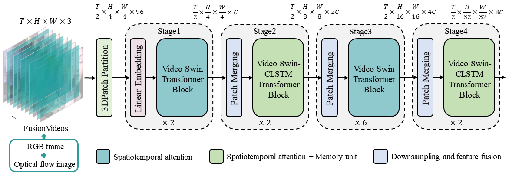

# Video Swin-CLSTM Transformer: Enhancing human action recognition with optical flow and long-term dependencies

## Abstract

<!-- [ABSTRACT] -->

As video data volumes soar exponentially, the significance of video content analysis, particularly Human Action Recognition (HAR), has become increasingly prominent in domains such as intelligent surveillance, sports analytics, medical rehabilitation, and virtual reality. However, current deep learning-based HAR methods encounter challenges in recognizing subtle actionswithin complex backgrounds, comprehending long-term semantics, and maintaining computational efficiency.To address these challenges, we introduce the Video Swin-CLSTM Transformer. Based on the Video Swin Transformer backbone, our model incorporates optical flow information at the input stage to effectively counteract background interference, employing a sparse sampling strategy. Combined with the backbone’s 3D Patch Partition and Patch Merging techniques, it efficiently extracts and fuses multi-level features from both optical flow and raw RGB inputs, thereby enhancing the model’s ability to capture motion characteristics in complex backgrounds. Additionally, by embedding Convolutional Long Short-Term Memory (ConvLSTM) units, the model’s capacity to capture and understand long-term dependencies among key actions in videos is further enhanced.Experiments on the UCF-101 dataset demonstrate that our model achieves mean Top-1/Top-5 accuracies of 92.8% and 99.4%, which are 3.2% and 2.0% higher than those of the baseline model (89.6% and 97.4%, respectively), while the computational cost is reduced by an average of 3.3% at peak performance compared to models without optical flow. These experimental results indicate that our model offers certain advantages over other Swin Transformer-based methods for video HAR tasks.

<!-- [IMAGE] -->

<div style="text-align:center">
  
</div>

## Usage

### Setup Environment

**Step1**.Please refer to [Get Started](https://mmaction2.readthedocs.io/en/latest/get_started/installation.html) to install MMAction2 (we recommend building MMAction2 from the source code).

**Step2**.After installing MMAction2, the project directory structure is as follows:

```
mmaction2/
├── configs/                   # Configuration files for models and pipelines
   │   ├── recognition/        # Configs for action recognition models
   │   ├── _base_/             # Base configs shared across models
   │   └── ...
   │
   ├── data/                   # Directory for storing datasets (user-created)
   │   ├── rawframes/
   │   └── ...
   │
   ├── mmaction/               # Core library of MMAction2
   │   ├── datasets/           # Dataset definitions and handling
   │   ├── models/             # Model architectures and components
   │   └── ...
   │
   ├── projects/               # Custom or community-contributed projects
   │   ├── example_project/    # Example project structure
   │   ├── ...
   │
   ├── tools/                  # Utility scripts and tools
   │   ├── data/               # Data preparation scripts
   │   ├── train.py            # Script for model training
   │   ├── test.py             # Script for model testing
   │   └── ...
```

**Step3**.After that, moving this project (Video_Swin_CLSTM) to the **projects** directory of the mmaction2 project, the directory structure after the move is as follows:

```
mmaction2/
├── configs/                # Configuration files for models and pipelines
│   └── ...
│
├── data/                   # Directory for storing datasets (user-created)
│   └── ...
│
├── mmaction/               # Core library of MMAction2
│   └── ...
│
├── projects/               # Custom or community-contributed projects
│   ├── Video_Swin_CLSTM/   # Our Video Swin-CLSTM Transformer project
│   ├── ...
│
├── tools/                  # Utility scripts and tools
│   └── ...
```

Up to this point, our own project has been embedded into MMAction2.

### Data Preparation

Prepare the UCF-101 dataset according to the [local instruction](./data/ucf101/README.md) and [3rd instruction](https://github.com/open-mmlab/mmaction2/blob/main/tools/data/ucf101/README.md).

**Step1**.The download link of the UCF-101 dataset: [UCF101 dataset](https://www.crcv.ucf.edu/research/data-sets/ucf101/)

**Step2**.After prepared the dataset, then run the following command to extract the optical flow:

```
bash ./tools/extract_flow_ucf101.sh
```

**Step3**.Run the following command to stack the optical flow images into 3 channels:

```
bash ./tools/stackFlowChannel_ucf101.sh
```

**Step4**.After preparing the optical flow and RGB frames, use the following command to clean them and adjust the proportion of optical flow:

```
python ./tools/rename.py
python ./tools/concat_filename.py
python ./tools/reorder.py
python ./tools/delete.py
```

Create a symbolic link from `$MMACTION2/data` to `./data` in the current directory, so that Python can locate your data. Run the following command in the current directory to create the symbolic link.

```shell
ln -s ../../data ./data
```

At first, add the current folder to `PYTHONPATH`, so that Python can find your code. Run command in the current directory to add it.

> Please run it every time after you opened a new shell.

```shell
export PYTHONPATH=`pwd`:$PYTHONPATH
```

### Training commands

**To train with single GPU:**

```bash
mim train mmaction configs/video_swin_clstm-p244-w877_8xb8-amp-32x2x1-30e_ucf101-rgb+flow.py
mim train mmaction configs/video_swin_clstm-p244-w877_8xb8-amp-32x2x1-30e_ucf101-rgb+flow_sparse.py
```

**To train with multiple GPUs:**

```bash
mim train mmaction configs/video_swin_clstm-p244-w877_8xb8-amp-32x2x1-30e_ucf101-rgb+flow.py --launcher pytorch --gpus 4
mim train mmaction configs/video_swin_clstm-p244-w877_8xb8-amp-32x2x1-30e_ucf101-rgb+flow_sparse.py --launcher pytorch --gpus 4
```

**To train with multiple GPUs by slurm:**

```bash
mim train mmaction configs/video_swin_clstm-p244-w877_8xb8-amp-32x2x1-30e_ucf101-rgb+flow.py --launcher slurm \
    --gpus 4 --gpus-per-node 4 --partition $PARTITION
```

### Testing commands

**To test with single GPU:**

```bash
mim test mmaction configs/video_swin_clstm-p244-w877_8xb8-amp-32x2x1-30e_ucf101-rgb+flow.py --checkpoint $CHECKPOINT
```

**To test with multiple GPUs:**

```bash
mim test mmaction configs/video_swin_clstm-p244-w877_8xb8-amp-32x2x1-30e_ucf101-rgb+flow.py --checkpoint $CHECKPOINT --launcher pytorch --gpus 4
```

**To test with multiple GPUs by slurm:**

```bash
mim test mmaction configs/video_swin_clstm-p244-w877_8xb8-amp-32x2x1-30e_ucf101-rgb+flow.py --checkpoint $CHECKPOINT --launcher slurm \
    --gpus 4 --gpus-per-node 4 --partition $PARTITION
```

## Results

### UCF-101 (Using our custom pre-train model:ImageNet-1K-LSTM for our model)

| Model | Input | Pretrain | Top1 acc | Top5 acc |  FLOPs(G) |                                                                                                                                                                                            |
| :---------------------: | :----------: | :--------------: | :------: | :------: | :---: |
|   Video Swin-T          | RGB          | ImageNet-1K      |   89.6   |   97.4   |  93   |
|   Video Swin-T          | RGB+Flow     | ImageNet-1K      |   92.2   |   99.1   |  91   |
|   Video Swin-T          | LessRGB+Flow | ImageNet-1K      |   91.7   |   98.6   |  76   |
|   Video Swin-CLSTM      | RGB          | ImageNet-1K-LSTM |   91.5   |   98.7   |  273  |
|   Video Swin-CLSTM      | RGB+Flow     | ImageNet-1K-LSTM | **92.8** | **99.4** |  261  |
|   Video Swin-CLSTM      | LessRGB+Flow | ImageNet-1K-LSTM |   92.5   |   99.3   |  239  |

\[1\] The models are ported from the repo [ActionCLIP](https://github.com/sallymmx/ActionCLIP) and tested on our data. Currently, we only support the testing of ActionCLIP models. Due to the variation in testing data, our reported test accuracy differs from that of the original repository (on average, it is lower by one point). Please refer to this [issue](https://github.com/sallymmx/ActionCLIP/issues/14) for more details.
